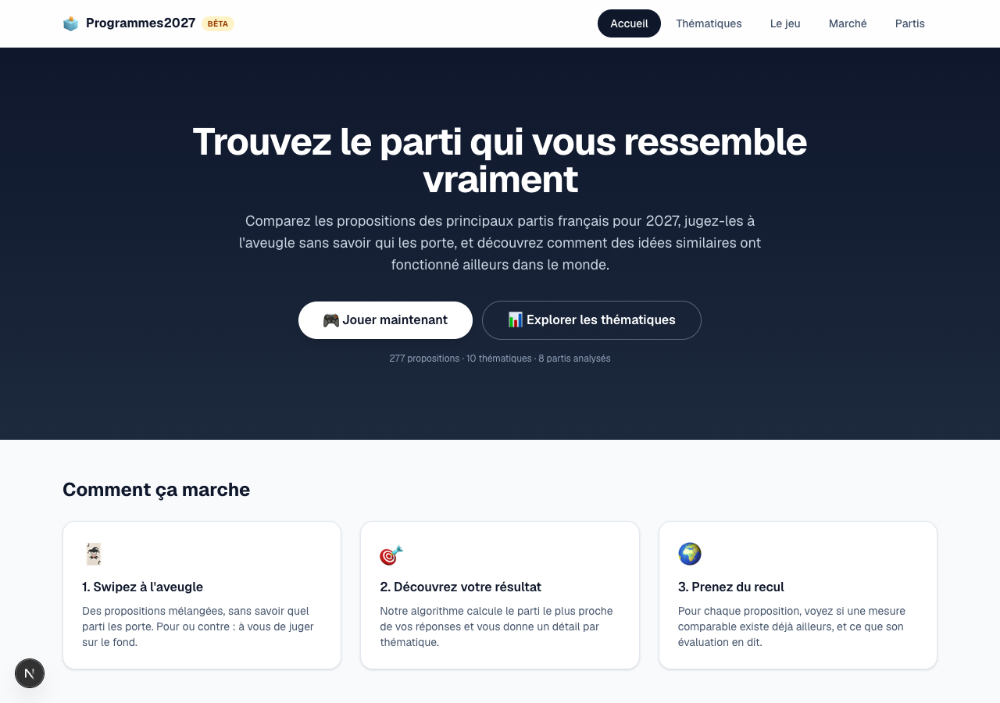
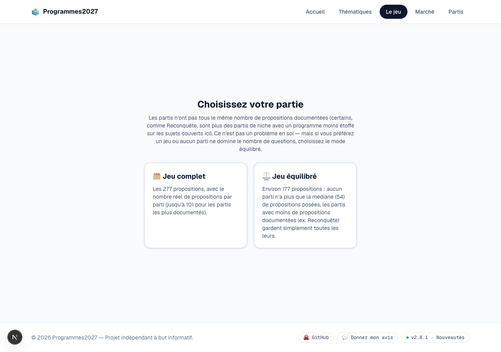
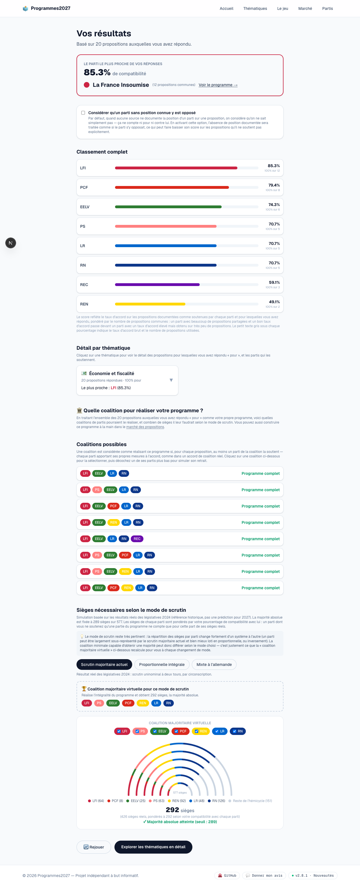
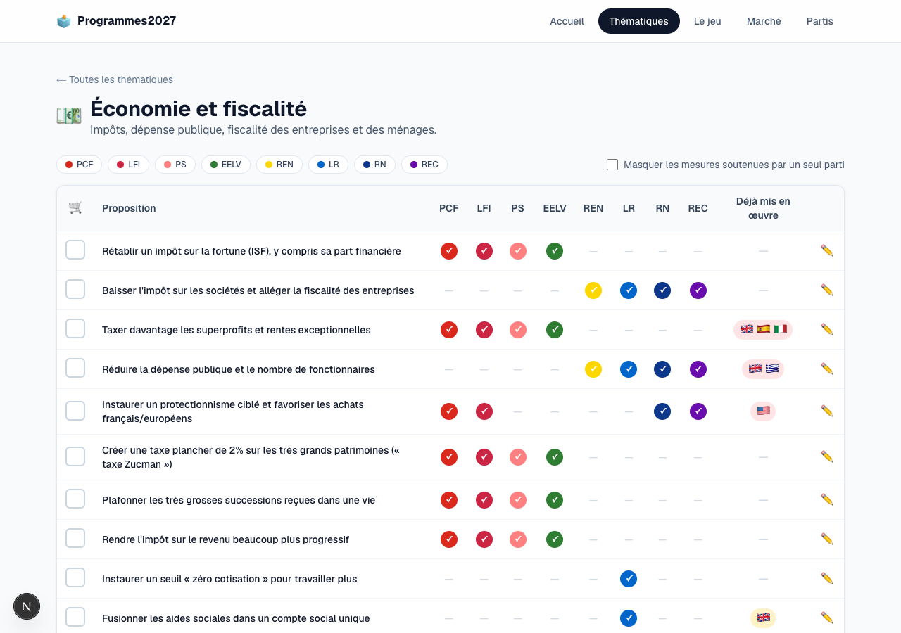
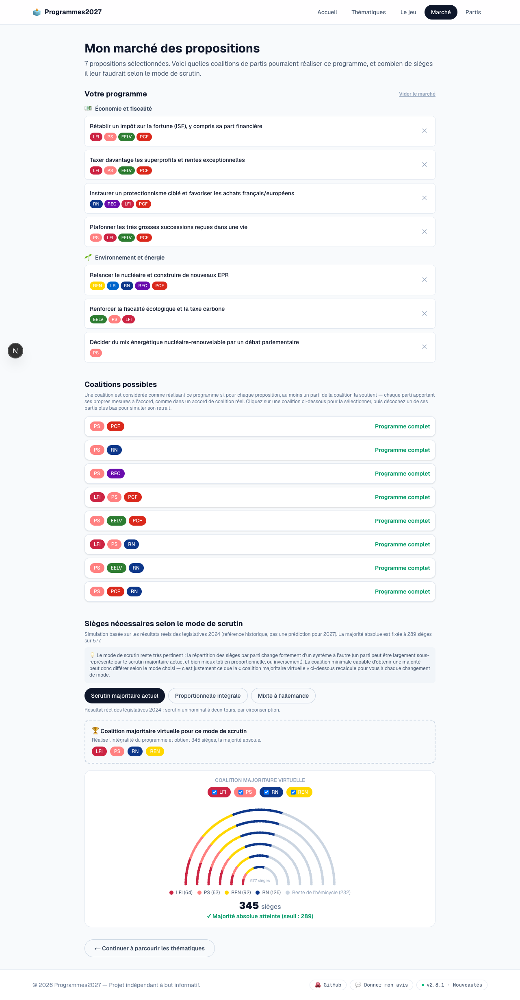
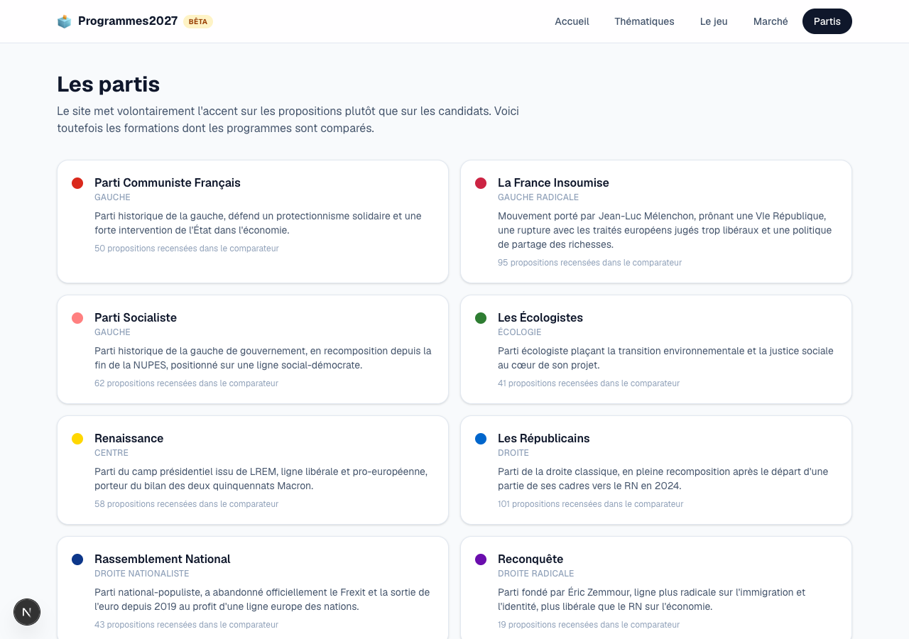

# 🗳️ Programmes2027

**Comparez les programmes des partis politiques français pour 2027, à l'aveugle, thème par thème.**

Programmes2027 est un projet indépendant et à but informatif qui recense
les propositions concrètes de 8 partis (LFI, PS, Les Écologistes,
Renaissance, LR, RN, Reconquête, PCF) — sourcées depuis leurs programmes,
livrets et cahiers thématiques officiels — pour vous permettre de vous
faire votre propre avis, sans a priori.

> 🔗 [Voir le site](https://programmes2027.ghostwan.workers.dev) · [Changelog](https://programmes2027.ghostwan.workers.dev/changelog)



## Pourquoi ce projet ?

Les programmes politiques sont longs, dispersés dans des dizaines de PDF
et de pages web, et on aborde souvent une proposition en sachant déjà
quel parti la porte — ce qui biaise le jugement qu'on peut en avoir.
Programmes2027 essaie de contourner ça : en jouant à l'aveugle d'abord,
en comparant ensuite, thème par thème, en tenant compte de ce qui existe
déjà ailleurs dans le monde.

## Fonctionnalités

### 🕹️ Le jeu — jugez les propositions à l'aveugle

Avant de commencer, choisissez entre le **jeu complet** (toutes les
propositions, chaque parti avec son nombre réel de propositions
documentées) et un **jeu équilibré** plus court, où aucun parti ne
fournit plus que la médiane du nombre de propositions posées — les
partis moins documentés (par exemple Reconquête, qui reste une niche
avec un programme plus restreint sur les sujets couverts ici) gardent
simplement toutes les leurs.

Swipez (ou cliquez) chaque proposition « pour » ou « contre », sans
savoir quel parti la porte. L'ordre est mélangé à chaque partie, mais
équilibré pour que les propositions de chaque parti apparaissent à un
rythme régulier tout au long du jeu (plutôt que de dépendre du seul
hasard, ce qui pourrait sinon fortement biaiser le score d'un parti peu
documenté si vous consultez vos résultats avant la fin). Vous pouvez
revenir en arrière pour changer une réponse, sauter une question que
vous ne maîtrisez pas, et voir vos résultats à tout moment (même sans
avoir terminé) une fois un nombre minimal de réponses atteint. Votre
progression est sauvegardée automatiquement dans votre navigateur pour
reprendre plus tard.



À la fin, vos résultats vous indiquent le(s) parti(s) le(s) plus
proche(s) de vos réponses (tous affichés ex æquo en cas d'égalité
parfaite, plutôt qu'un choix arbitraire), le détail par thématique (avec, pour chaque thématique, la
liste des propositions auxquelles vous avez répondu « pour » et les
partis qui les soutiennent), un réglage pour choisir si l'absence de
position connue d'un parti doit être traitée comme neutre ou comme une
opposition implicite, et — à partir de l'ensemble de vos réponses
« pour » traitées comme votre propre programme — la même exploration de
**coalitions de partis et de sièges à l'Assemblée** que dans le marché
des propositions (voir ci-dessous).




### 📊 Comparateur par thématique

Dix thématiques (économie, travail, immigration, sécurité, éducation,
santé, environnement, Europe, institutions, logement), chacune avec un
tableau comparatif complet :

- **Colonnes cliquables** pour afficher/masquer un parti à la volée et
  se concentrer sur ceux qui vous intéressent.
- Filtre pour **masquer les mesures soutenues par un seul parti** et se
  concentrer sur ce qui fait vraiment débat.
- Une colonne **« Déjà mis en œuvre »** : quand une mesure comparable a
  été appliquée ailleurs dans le monde, un drapeau l'indique — coloré en
  vert, rouge ou ambre selon que le bilan documenté (institutions,
  études) est plutôt positif, négatif ou mitigé.
- Un lien ✏️ pour **signaler une correction** (un parti manquant, une
  source à ajouter...) directement via une issue GitHub pré-remplie.



### 🛒 Le marché des propositions — composez votre propre programme

Piochez librement des propositions à travers tous les thèmes et tous les
partis pour construire votre propre programme, puis découvrez :

- quelles **coalitions de partis** pourraient le réaliser (chaque parti
  apportant les mesures qu'il soutient, comme dans un accord de
  coalition réel) ;
- combien de **sièges à l'Assemblée nationale** cette coalition
  obtiendrait selon le mode de scrutin — scrutin majoritaire actuel
  (résultats réels des législatives 2024), proportionnelle intégrale, ou
  scrutin mixte à l'allemande — visualisés dans un hémicycle, comparés
  au seuil de majorité absolue (289 sièges sur 577) ;
- la **coalition majoritaire virtuelle** : la plus petite coalition
  capable à la fois de réaliser le programme et d'atteindre la majorité
  absolue *sous le mode de scrutin choisi* — recalculée et affichée par
  défaut dans l'hémicycle à chaque changement de mode, puisque la
  répartition des sièges par parti (et donc la coalition minimale
  nécessaire) diffère fortement d'un système à l'autre ;
- l'**exclusion d'un parti de la coalition sélectionnée** (case à cocher
  sur chaque parti) pour voir instantanément le nombre de sièges perdus
  et la liste des propositions de votre programme qui ne pourraient
  alors plus être réalisées sans lui.

Sur la page des résultats du quiz, les sièges de chaque parti sont en
plus **pondérés par votre pourcentage de compatibilité** avec lui : un
parti dont vous ne soutenez qu'une partie du programme ne compte plus
que pour cette part de ses sièges réels dans le total de la coalition
(le nombre de sièges réels reste affiché à titre indicatif).



### 🏛️ Fiches partis

Une fiche par parti avec toutes ses propositions regroupées par
thématique, et des **liens vers ses sources officielles** (programme,
livrets, cahiers thématiques) pour vérifier par vous-même.



### 🛡️ Autres détails

- Protection anti-robots par Cloudflare Turnstile (à la place d'un mot
  de passe), pour limiter le pillage automatisé de contenu tout en
  restant accessible à tous.
- Site presque entièrement statique et mis en cache agressivement, pour
  rester rapide et peu coûteux à faire tourner.
- Un [changelog](https://programmes2027.ghostwan.workers.dev/changelog)
  public de toutes les évolutions du site.
- Un bouton « Donner mon avis » en pied de page pour signaler un bug ou
  une suggestion via une issue GitHub pré-remplie.

## Sources et méthodologie

Chaque proposition n'est attribuée qu'aux partis dont le soutien est
documenté par une source officielle (programme, livret, cahier
thématique, déclaration publique). L'absence d'un parti sur une
proposition signifie simplement qu'aucune source n'a établi sa position
dessus — **pas** qu'il s'y oppose. Ce choix méthodologique est expliqué
sur le site et pris en compte par défaut dans le calcul des scores du
jeu.

Toutes les données ne sont pas exhaustives : les programmes des partis
pour 2027 sont mis à jour et complétés au fil du temps, et cette base de
données l'est également. Vous pouvez consulter et éditer directement les
données dans
[`src/lib/data/propositions.ts`](src/lib/data/propositions.ts).

## Stack technique

- **[Next.js](https://nextjs.org)** (App Router) + React + TypeScript
- **Tailwind CSS** pour le style
- **Framer Motion** pour l'interaction de swipe du jeu
- Déployé sur **Cloudflare Workers** via
  [`@opennextjs/cloudflare`](https://opennext.js.org/cloudflare), avec un
  cache d'assets statiques pour minimiser les sollicitations serveur
- **Cloudflare Turnstile** pour la protection anti-robots

## Développement

```bash
npm install
npm run dev
```

Ouvrez [http://localhost:3000](http://localhost:3000).

### Scripts utiles

| Commande | Description |
| --- | --- |
| `npm run dev` | Serveur de développement |
| `npm run build` | Build de production Next.js |
| `npm run lint` | Vérification ESLint |
| `npm run preview` | Prévisualisation locale via Wrangler (Cloudflare) |
| `npm run deploy` | Bump de version + build + déploiement Cloudflare |
| `npm run version:bump` | Calcule et applique le bump de version depuis `CHANGELOG.md` |

Le versionnage suit [Semantic Versioning](https://semver.org/lang/fr/) et
est entièrement piloté par `CHANGELOG.md` — voir `AGENTS.md` pour les
règles de contribution détaillées.

## Contribuer

Une erreur, une proposition manquante, une source à ajouter, une idée
d'amélioration ? Ouvrez une
[issue sur GitHub](https://github.com/ghostwan/Programmes2027/issues),
ou utilisez directement les liens « ✏️ Signaler » et « 💬 Donner mon
avis » présents sur le site.

## Licence

Ce projet est distribué sous licence [MIT](LICENSE).

---

*Programmes2027 est un projet indépendant, sans affiliation avec un parti
politique. Toutes les données sont sourcées et vérifiables ; en cas
d'erreur ou d'omission, merci de la signaler.*
